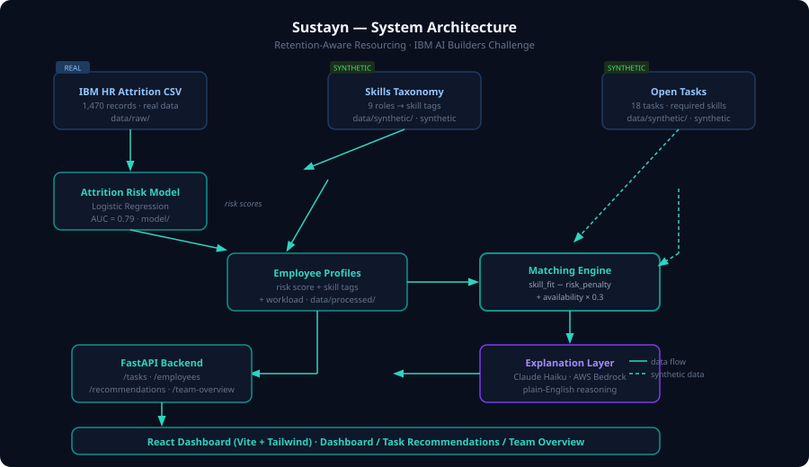

# Sustayn — Retention-Aware Resourcing
### IBM AI Builders Challenge · Wildcard: Intelligent Systems for the Future of Work

> *Match the work to the person who can do it well — and can afford to.*

---

## Executive Summary

Sustayn is a decision-support tool for managers who allocate people to projects and tasks. It combines **skill fit**, **current workload**, and an **illustrative attrition-risk signal** so that the most capable employee does not automatically become the most overloaded employee.

The commercial case is simple: [Gallup estimates](https://www.gallup.com/workplace/646538/employee-turnover-preventable-often-ignored.aspx) that replacing a technical professional costs about **80% of salary**, while replacing a manager or leader costs about **200%**. For a technical employee earning $75,000, one departure can represent roughly **$60,000 in replacement cost**. At an illustrative SaaS price of $5 per employee per month, a 200-person customer would spend $12,000 per year; if Sustayn contributed to avoiding just one such departure, that would represent a potential **5× benefit-to-cost ratio**.

Sustayn does not automate employment decisions or claim to predict resignations with certainty. It gives managers a transparent recommendation, exposes every scoring component, and keeps the final decision with a human.

---

## Problem Statement

Managers assign work based on memory and availability, not on a systematic view of skill fit or sustainability. The best, most visible performers become the default assignee for every new task — quietly accumulating workload and burnout risk that nobody tracks until they resign.

This is an expensive management problem. Gallup estimates that replacing a frontline employee costs about **40% of salary**, a technical professional **80%**, and a manager or leader **200%**. Gallup also found that **42% of voluntary departures were preventable**; among preventable leavers, day-to-day management issues included staffing and workload concerns. ([Gallup, 2024; updated 2026](https://www.gallup.com/workplace/646538/employee-turnover-preventable-often-ignored.aspx))

**The gap:** organisations have skill data (who can do what) and attrition-risk signals (who's likely to leave) sitting in separate systems, and nobody combines them at the moment a resourcing decision is actually made.

---

## Solution

Sustayn is an AI-powered resourcing assistant that recommends who should take on a new task by balancing two signals that are normally considered separately:

1. **Skill fit** — who is best qualified for this work
2. **Sustainability** — who has headroom, and who is already over-allocated and at elevated attrition risk

Instead of a single ranked name, it returns a **reasoned recommendation** — including cases where it deliberately recommends *against* the top skill match because assigning them would compound an existing risk — and a team-level view that surfaces employees who have quietly become the "default assignee" for repeated tasks.

### Why Now

Enterprises are already building structured skills foundations. For example, [SAP's Talent Intelligence Hub](https://help.sap.com/docs/successfactors-platform/using-talent-intelligence-hub/talent-intelligence-hub) centralises employee skills and connects them with internal opportunities. Project-management systems already hold workload and assignment data. Sustayn's opportunity is to become the **decision layer between those systems**: joining skills, capacity, and retention signals at the moment work is allocated.

```text
HR and skills systems  ─┐
Project/workload tools ─┼─> Sustayn recommendation ─> Human manager decision
People analytics       ─┘
```

---

## AI Approach & Architecture



### Scoring Formula

```
score(employee, task) =
    skill_fit_score                          (0–1: % of required skills matched)
    − risk_penalty                           (only if risk > 0.6 AND tasks ≥ 4)
    + availability_bonus × 0.3              (headroom: remaining tasks / ceiling)

where:
    risk_penalty = attrition_risk_score × 0.4
    availability_bonus = (5 − tasks_assigned) / 5
```

The risk penalty only activates when **both** conditions are true: elevated attrition risk **and** high current workload. A high-risk employee with spare capacity is not penalised — the problem is compounding risk onto someone already stretched, not risk in isolation. This conditional logic is the core defensibility argument of the scoring design.

### Model Details

- **Dataset:** [IBM HR Analytics Employee Attrition & Performance](https://www.kaggle.com/datasets/pavansubhasht/ibm-hr-analytics-attrition-dataset) — IBM's illustrative/synthetic HR dataset (1,470 records, 35 features)
- **Model:** Logistic Regression (scikit-learn), trained on 80/20 stratified split
- **Validation:** AUC = 0.7929 on held-out test set; see `model/evaluation_notebook.ipynb` for full evaluation
- **LLM:** Claude Haiku via Amazon Bedrock generates the plain-English recommendation paragraph, including narrating the "bypass" case. Falls back to a rule-based explanation if credentials are not configured.

---

## Data Sources

| File | Type | Description |
|---|---|---|
| `data/raw/ibm_hr_attrition.csv` | **Real data** | IBM HR Attrition dataset from Kaggle — untouched original |
| `data/synthetic/skills_taxonomy.json` | **Synthetic** | Role → skill tags mapping constructed for this demo |
| `data/synthetic/open_tasks.json` | **Synthetic** | 18 open tasks with required skills, urgency, and effort |
| `data/processed/employee_profiles.csv` | **Derived** | IBM dataset + model risk scores + synthetic skills/workload |

The skills taxonomy and open-tasks dataset are synthetic overlays, not real data. This is a deliberate, transparent design choice — the IBM dataset contains no skills field or live workload data. The approach is described clearly rather than implied as real.

---

## How to Run

### Prerequisites

- Python 3.10+
- AWS credentials with Bedrock access (Claude Haiku model enabled in your region)

### Setup

```bash
# Clone the repo
git clone https://github.com/charlenegunawanteguh/sustayn.git
cd sustayn

# Create and activate a virtual environment
python3 -m venv venv
source venv/bin/activate  # Windows: venv\Scripts\activate

# Install dependencies
pip install -r requirements.txt

# Configure your AWS credentials
cp .env.example .env
# Edit .env and set AWS_BEARER_TOKEN_BEDROCK to your long-term Bedrock bearer token
# AWS_REGION defaults to us-east-1 — change if your Bedrock access is in another region
```

### Train the model (run once)

```bash
# Place ibm_hr_attrition.csv in data/raw/ first
python model/train_attrition_model.py
```

### Start the backend

```bash
uvicorn backend.app:app --reload
# API docs available at http://localhost:8000/docs
```

### Build and serve the frontend

```bash
# Build the React app (run once, or after any frontend changes)
cd frontend_react && npm install && npm run build && cd ..

# The React dashboard is now served by FastAPI at http://localhost:8000
# No separate frontend server needed
```

### Run tests

```bash
pytest backend/tests/test_matching_engine.py -v
```

---

## How IBM Bob Was Used

IBM Bob was used throughout every phase of this build:

1. **Repo scaffolding** — Bob generated the full directory structure, `requirements.txt`, `.env.example`, and all stub files in a single pass
2. **Data pipeline** — Bob wrote `model/train_attrition_model.py`, including the LabelEncoder pipeline, train/test split strategy, AUC evaluation, and the synthetic `tasks_assigned` counter weighted by `OverTime` + `JobInvolvement`
3. **Synthetic data design** — Bob constructed all 9 role → skill-tag mappings in `skills_taxonomy.json` and all 18 tasks in `open_tasks.json`, ensuring consistent tag strings across both files
4. **Matching engine** — Bob implemented the conditional risk-penalty scoring formula, including the critical boundary logic (penalty fires only on elevated risk AND high workload, not either alone), and structured the `rank_candidates` function to expose both `final_rank` and `skill_rank` for displacement detection
5. **API layer** — Bob generated all FastAPI routes, CORS middleware, lifespan data-loading pattern, and the SPA static file serving setup
6. **Unit tests** — Bob wrote 18 tests covering all four risk-penalty boundary quadrants, skill-fit edge cases, and the displacement scenario
7. **Explanation prompt engineering** — Bob designed and iterated the Claude Haiku (AWS Bedrock) prompt in `explanation_layer.py` to explicitly narrate the "bypassed top match" case when it occurs, and added a rule-based fallback so the app never crashes when credentials are unavailable
8. **React frontend** — Bob scaffolded the full React + Vite + Tailwind CSS frontend with three pages (Dashboard, Recommendations, Team Overview), the displaced-top-match warning banner, colour-coded risk/workload indicators, interactive score breakdown, and all API integration
9. **Architecture decisions** — Bob recommended replacing Streamlit with React for competition-quality polish, designed the FastAPI static-file serving pattern so both API and frontend run on one port, and debugged the AWS Bedrock model ID to the correct `us.anthropic.claude-haiku-4-5-20251001-v1:0`

---

## Challenge Theme

**Wildcard Challenge: Intelligent Systems for the Future of Work**
Category: Decision Intelligence / Operations & Productivity

Sustayn addresses the challenge by making invisible over-allocation visible at the exact moment a resourcing decision is made — combining skill fit and attrition-risk signals that are normally kept separate.

---

## Business Case

### Initial Customer

The initial target is a **200–1,000-person project-based organisation** where managers frequently allocate scarce specialists across competing work: consulting firms, technology and product organisations, engineering teams, agencies, and clinical-research operations.

- **Economic buyer:** COO, Head of Resource Management, or professional-services leader
- **Co-owner:** HR or People Analytics
- **Primary user:** project, delivery, and resource managers
- **Initial job to be done:** staff work quickly without repeatedly loading the same high performers

### Illustrative Unit Economics

Worked example for a 200-person organisation and one technical employee earning $75,000:

| Item | Calculation | Value |
|---|---:|---:|
| Cost to replace one technical employee | $75,000 × 80% | **$60,000** |
| Illustrative annual Sustayn subscription | 200 × $5 × 12 months | **$12,000** |
| Potential benefit if one departure is avoided | $60,000 ÷ $12,000 | **5×** |

This is a scenario, not a guaranteed return. Attrition has many causes, and a production pilot should not claim sole causation. The commercially testable proposition is whether Sustayn reduces risky allocation decisions and improves workload distribution enough to contribute to retention.

### Route to Market

1. Run a **4–6 week pilot** in one department with 50–200 employees.
2. Import skills from an HR system and workload from a project-management system.
3. Keep every recommendation human-reviewed and record overrides.
4. Measure leading indicators before attempting to measure long-term attrition.
5. Expand to other departments after demonstrating operational value.

Pilot success metrics:

- Percentage of new assignments given to already overloaded employees
- Change in workload concentration across the team
- Time required to identify qualified, available candidates
- Recommendation acceptance and manager override rates
- Number of danger-zone assignments flagged or prevented
- Employee-reported workload fairness

### Integration Roadmap

- **HR and skills:** Workday, SAP SuccessFactors, or CSV/API import
- **Work management:** Jira, Asana, Monday.com, or professional-services automation tools
- **Workflow:** recommendations delivered through the web app, Slack, or Microsoft Teams
- **Governance:** role-based access, audit logs, employee data correction, and model monitoring

---

## Responsible Deployment

Employee-management AI requires more than model accuracy. The [EU AI Act identifies certain AI systems used for worker management and task allocation as high-risk](https://ai-act-service-desk.ec.europa.eu/en/ai-act/recital-57). A production version of Sustayn should therefore be designed around:

- **Human oversight:** the system recommends; a manager decides and can override
- **Transparency:** skill fit, availability, penalties, and final scores remain visible
- **Data minimisation:** use only relevant, authorised workforce data
- **Contestability:** employees can review and correct skills or workload information
- **Fairness testing:** monitor outcomes across protected groups before deployment
- **Traceability:** log inputs, model version, recommendation, explanation, and final decision
- **Appropriate access:** individual attrition predictions should be restricted to authorised HR users; managers can receive actionable capacity guidance instead of a blunt “likely to leave” label

These controls are not an afterthought: they are necessary for buyer trust, employee adoption, and enterprise viability.

---

## Known Caveats

- **Attrition model is illustrative, not validated.** It is trained on IBM's synthetic/illustrative dataset and should be treated as a proof-of-concept methodology, not a production-grade risk model.
- **Skills and workload data are synthetic overlays.** The IBM dataset contains no skills field or live workload data. These were constructed deliberately and transparently for the demo.
- **Scoring formula is intentionally simple.** The conditional risk-penalty logic is the key design decision — a judge asking "isn't this just weighted sorting?" can be answered by explaining that the penalty only fires on the compound condition, not either factor alone.

---

## Demo Video

[▶ Watch the 3-minute demo](https://drive.google.com/file/d/1c7hA4YQPmBc7dVtJXoDHXGVZExOpJ37E/view?usp=sharing)

---

## License

MIT — see [LICENSE](LICENSE)
